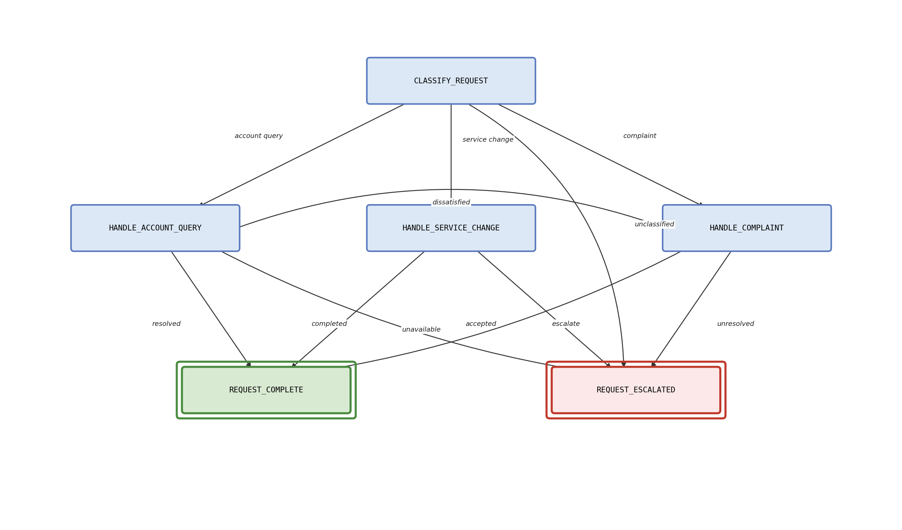

# Workflow as a Tool (WaaT) Claude Sonnet Evaluation

This folder contains the evaluation prototype for the paper **Workflow as a Tool
(WaaT)**. It demonstrates how workflow state can be exposed as executable tools
instead of being embedded entirely in a prompt.



## What This Prototype Shows

- `check_workflow` and `update_workflow` enforce step-scoped workflow access and
  valid state transitions.
- Claude Sonnet on Amazon Bedrock selects WaaT transitions from the visible
  state specification and mock utility-agent output.
- A Claude Sonnet workflow-as-prompt baseline receives the full YAML workflow and
  predicts the complete path without WaaT tools.
- Claude Sonnet scores the transition reasoning quality.
- The benchmark includes adversarial synthetic cases so results are not
  oracle-perfect.

## Requirements

Install dependencies from this folder:

```bash
python -m pip install -r requirements.txt
```

The evaluation uses Amazon Bedrock through `boto3`. It expects AWS credentials
with `bedrock:InvokeModel` access to the configured inference profile.

## Run

```bash
python run_evaluation.py
```

The runner loads simple AWS credentials from either `../.env` or `.env` before
creating the Bedrock client. The default model ID is the Vocus application
inference profile:

```bash
arn:aws:bedrock:ap-southeast-2:041538338020:application-inference-profile/umjk7k37bjmb
```

Override it with `--model-id` or `BEDROCK_MODEL_ID` if needed. Use `--limit N`
for a smoke test.

To run the full scaling experiment across 6, 20, 50, and 100-node workflow
variants:

```bash
python run_scaling_evaluation.py
```

If your corporate network intercepts TLS, configure the corporate root CA as a
PEM bundle with either `AWS_CA_BUNDLE` or `--ca-bundle`. For a short local smoke
test only, you can pass `--no-verify-ssl`, but do not use that for paper
results.

## Outputs

- `results/runs/aws_results_table.csv`: one row per synthetic test case for a single workflow run.
- `results/runs/aws_summary_stats.json`: aggregate metrics for a single workflow run.
- `results/runs/aws_sample_traces.json`: representative account, service, and complaint traces.
- `results/runs/aws_results_table_latex.tex`: LaTeX table for a single workflow run.
- `results/runs/aws_<nodes>_results_table.csv`: per-size result tables for scaling runs.
- `results/runs/aws_<nodes>_summary_stats.json`: per-size aggregate metrics.
- `results/runs/aws_<nodes>_sample_traces.json`: representative traces per workflow size.
- `results/runs/aws_<nodes>_results_table_latex.tex`: LaTeX tables per workflow size.
- `results/scaling/scaling_summary.csv` and `results/scaling/scaling_summary.json`: consolidated scaling metrics.
- `figures/scaling_metrics.png`: token and accuracy scaling plot.
- `figures/workflow_graph_<nodes>_nodes.png`: rendered workflow graph per size.

## Structure

- `waat/workflow.py`: YAML loader and state graph.
- `waat/tools.py`: implementations of `check_workflow` and `update_workflow`.
- `waat/agent.py`: WaaT evaluation loop using Claude Sonnet on Bedrock.
- `waat/baseline.py`: Claude Sonnet workflow-as-prompt baseline without WaaT tools.
- `waat/mock_agents.py`: deterministic mock utility agents.
- `waat/evaluator.py`: Claude Sonnet reasoning-quality scorer.
- `waat/synthetic_data.py`: 30 synthetic customer requests.
- `waat/workflow_variants.py`: generated 6, 20, 50, and 100-node workflow variants.
- `waat/workflows/service_request.yaml`: workflow definition used by the evaluation.

## Production Context

The prototype is intentionally small, but the pattern is motivated by production
customer-service agents where workflows are larger and more numerous. In
production, a super-agent may coordinate multiple sub-agents to perform an end-to-end complex
task
